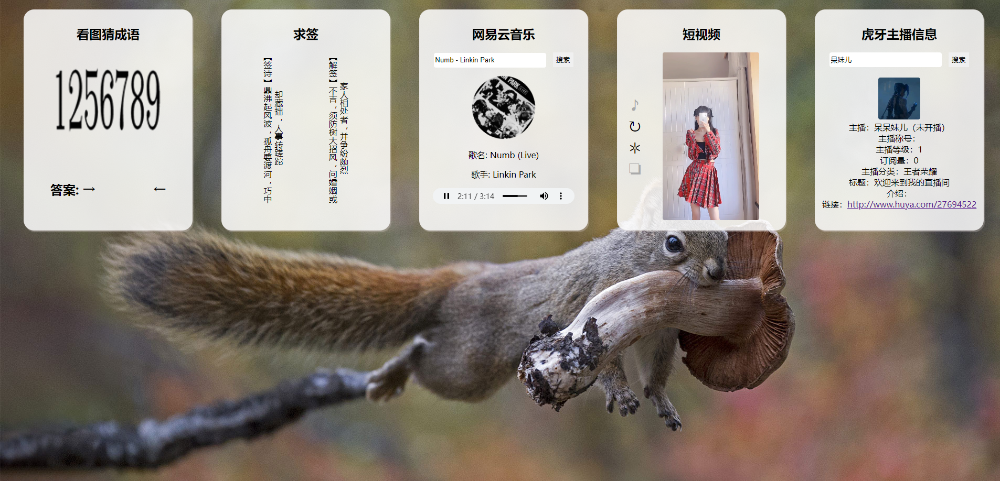

# 免费 Api 接口使用

> 接口来源：
> Suixin API ==> http://api.botwl.cn/
> 夏柔免费 API ==> https://api.aa1.cn/



## 一、看图猜成语 ✅

- 功能:
  1. 点击图片切换成语
  2. 鼠标移入答案双箭头中间位置显示成语

## 二、求签 ✅

- 功能:

  1. 双击卡片标题重新求签

## 三、网易云音乐 ✅

- 功能:
  1. 搜索音乐
  2. 点击封面切换音乐播放/暂停

## 四、短视频

- 功能:
  1. 是否静音按钮
  2. 切换视频按钮
  3. 自动切换按钮
  4. 全屏按钮、双击视频全屏/退出全屏
  5. 单击视频播放/暂停
  6. 音量控制 ❌

## 五、虎牙主播信息 ✅

- 功能:
  1. 主播信息搜索

## 六、看漫画 ❌

## 七、ToDoList ❌

## 八、随机音乐 ❌

## 九、补充功能点

1.  only one(页面只展示某个卡片) ❌
2.  卡片收起 ❌
3.  控制面板(集中设置其他卡片) ❌

## 十、其他说明

```bash
#  // https://bird.ioliu.cn/v2/ 可以作为 HTTP 接口代理
```
